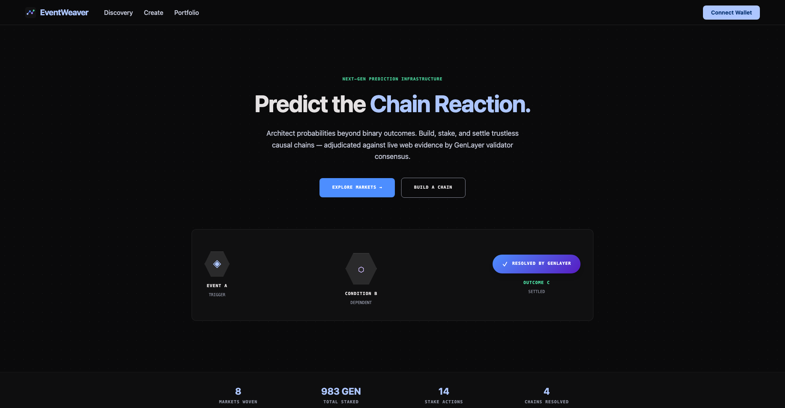
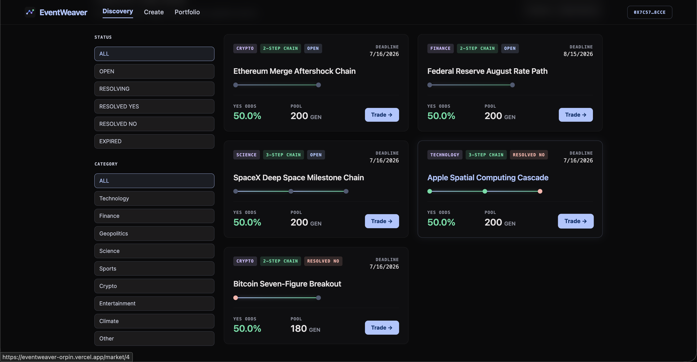
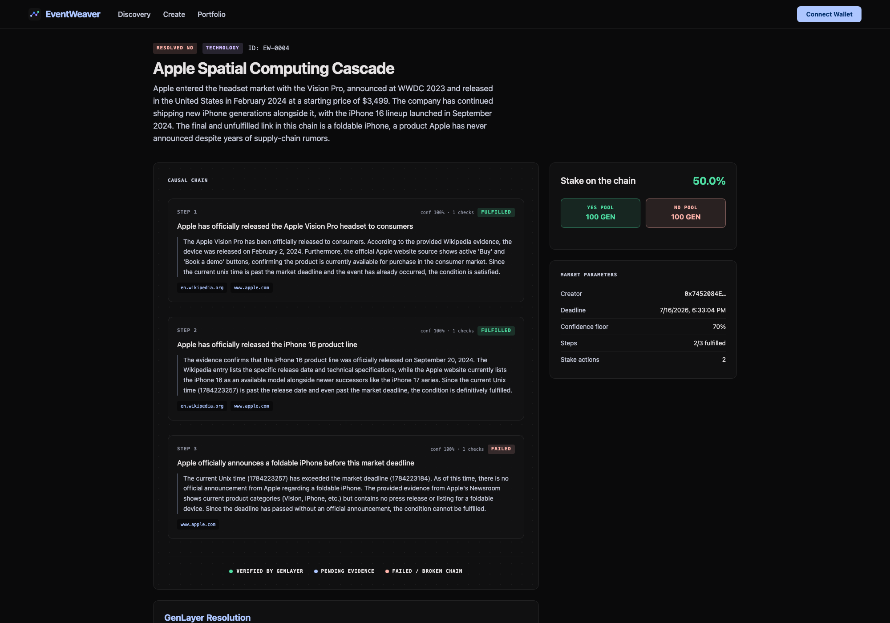
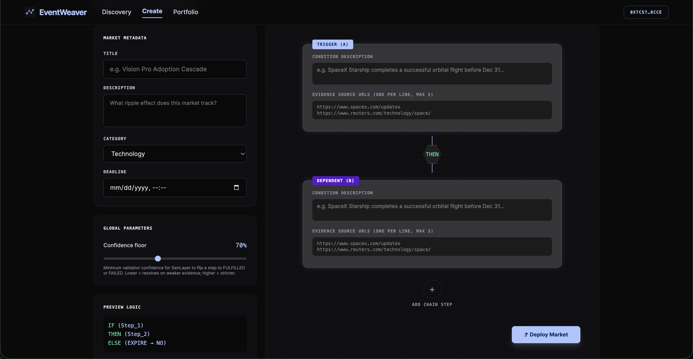
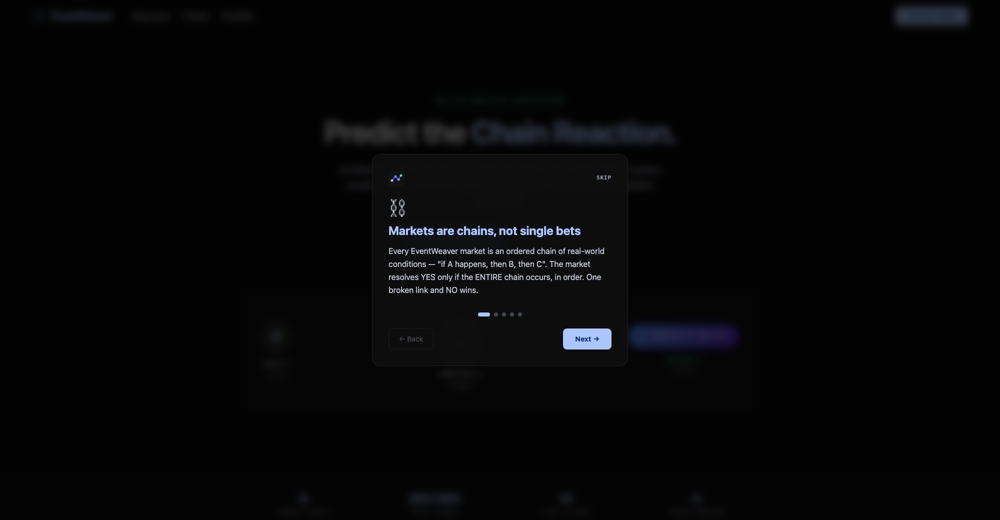

<div align="center">

# 🕸 EventWeaver

**Prediction markets for chain reactions, not isolated events.**

*Trustless causal-chain adjudication powered by GenLayer Intelligent Contracts.*

[**Live App**](https://eventweaver-orpin.vercel.app) · [**API**](https://eventweaver-api.fly.dev/health) · [**Contract on StudioNet**](#deployed-addresses) · [**Docs**](docs/)



</div>

---

## Table of contents

1. [What is EventWeaver](#what-is-eventweaver)
2. [Why this needs GenLayer](#why-this-needs-genlayer)
3. [Screenshots](#screenshots)
4. [How a market works (lifecycle)](#how-a-market-works)
5. [The value-transfer path](#the-value-transfer-path)
6. [Architecture](#architecture)
7. [The Intelligent Contract](#the-intelligent-contract)
8. [Backend (24/7)](#backend-247)
9. [Frontend](#frontend)
10. [Running locally](#running-locally)
11. [Deployment](#deployment)
12. [Testing & quality gates](#testing--quality-gates)
13. [Deployed addresses](#deployed-addresses)
14. [Project structure](#project-structure)
15. [Hard-won GenLayer lessons](#hard-won-genlayer-lessons)

---

## What is EventWeaver

Traditional prediction markets ask a single question: *"Will X happen?"*

EventWeaver markets are **ordered chains of dependent real-world conditions**:

> **IF** Apple releases the Vision Pro →
> **THEN** Apple releases the iPhone 16 →
> **THEN** Apple announces a foldable iPhone before the deadline

The market resolves **YES only if every step in the chain verifiably occurred, in order**.
One broken link and NO wins. Steps are verified against **live public web evidence** —
news pages, official announcements, price feeds, filings — by GenLayer's decentralized
AI-validator consensus, and every verdict's reasoning is stored on-chain for anyone to audit.

Users stake native **GEN** on YES or NO. Winners split the losing pool pro-rata. Winnings
withdraw back to the wallet as real native token transfers.

## Why this needs GenLayer

Resolution is a **trust problem, not an inference problem** — whoever resolves a market
controls the money, so resolution must be decentralized and the evidence must be verified
*inside consensus*, not asserted by a server:

- **Contract-side web fetching.** At adjudication time, each GenLayer validator
  independently renders the market's declared evidence URLs (`gl.nondet.web.render`)
  *inside GenVM*. No off-chain oracle feed, no user-submitted claims, no API keys.
- **Validators verify outcomes, not formats.** The equivalence principle
  (`gl.eq_principle.prompt_comparative`) requires validators to agree on the **actual
  verdict** — the `occurred` / `can_still_occur` booleans and a confidence band — after
  each has done its own fetch and LLM reasoning over the real page content.
- **Consensus-stable by design.** Verdicts are deliberately coarse (confidence bucketed to
  the nearest 5, sticky FULFILLED states, inconclusive-stays-PENDING), so honest validators
  converge. Verified live on StudioNet: one-round `MAJORITY_AGREE`, zero leader rotations,
  zero Undetermined results.
- **Transparent.** Per-step reasoning and evidence summaries are persisted on-chain and
  rendered in the UI's resolution report (see the screenshot below).

This cannot work as an off-chain AI app: a centralized resolver could steal every pool.

## Screenshots

**Discovery — live causal-chain markets with real evidence sources:**



**A resolved market — validators fetched Wikipedia/apple.com live and wrote their
reasoning on-chain (steps 1–2 FULFILLED at 100% confidence, step 3 FAILED):**



**The Visual Logic Builder — compose the chain, attach evidence URLs, set the
confidence floor, deploy:**



**First-visit walkthrough — five-step guided tour for new users (re-open any time via
"Take the tour" in the footer):**



## How a market works

```
OPEN ──────────────► RESOLVING ──────────► RESOLVED_YES   (every step FULFILLED)
 │   creator checks     │    auto-resolver ► RESOLVED_NO    (any step FAILED)
 │   steps early        │    at deadline   ► EXPIRED → NO   (deadline, chain incomplete)
 └──────────────────────┴─────────────────► CANCELLED       (refunds for everyone)
```

1. **Create** — anyone defines a 2–12 step chain; each step carries a natural-language
   condition and 1–5 public evidence URLs. A confidence floor (55–95%) sets how strong the
   evidence must be to flip a step.
2. **Stake** — anyone stakes native GEN on YES/NO **until the deadline**, even while
   adjudication is in progress. Odds are implied by the pool ratio.
3. **Adjudicate** —
   - *Before the deadline*: only the market creator (or platform owner) can trigger step
     checks, useful for progressively verifying long chains.
   - *After the deadline*: adjudication is permissionless **and automatic** — the 24/7
     backend resolver triggers it, validators fetch the evidence, and the chain settles.
   - Steps verify strictly in order; a FULFILLED step is sticky (events don't un-happen);
     inconclusive evidence never flips a step — it stays PENDING and is retried.
4. **Claim & withdraw** — winners claim stake + pro-rata share of the losing pool (minus
   1% protocol + 0.5% creator fee), then withdraw to their wallet as a native transfer.

## The value-transfer path

Real native token movement at every hop — no synthetic points:

| Hop | Mechanism |
| --- | --- |
| Stake in | `stake_yes` / `stake_no` / `deposit` are `@gl.public.write.payable`; the chain moves `gl.message.value` into the contract |
| Settlement | `claim()` computes stake + `losing_pool × my_stake / winning_pool` after fees, credits an internal balance |
| Withdraw out | `withdraw(amount)` emits a **real native transfer** to the caller via `emit_transfer(value=…, on='finalized')` |
| Fees | 1% protocol (owner-sweepable) + 0.5% creator, carved from the losing pool; creation bond returned on clean resolution |

All four hops are exercised live on StudioNet (see [docs/CONTRACT.md](docs/CONTRACT.md)).

## Architecture

```
┌──────────────┐    REST      ┌────────────────────┐  genlayer-js   ┌────────────────────┐
│  Frontend     │ ───────────► │  Backend API        │ ─────────────► │  GenLayer StudioNet │
│  React + Vite │              │  Express on Fly.io  │    reads       │                    │
│  (Vercel)     │              │  + Fly Postgres     │                │  EventWeaver        │
└──────┬───────┘              │  indexer + resolver │                │  Intelligent        │
       │   writes (MetaMask,   └────────────────────┘                │  Contract           │
       │   payable value) ──────────────────────────────────────────►└────────────────────┘
```

- **Reads** are served from the backend's Postgres mirror (fast, filterable), with a
  live-chain fallback per market.
- **Writes** (create, stake with value, adjudicate, claim, withdraw) go **directly from the
  user's wallet to the contract** — the backend never holds user keys.
- The backend also runs the **automatic deadline resolver** (Intelligent Contracts can't
  wake themselves; the always-on service is the trigger, while the *outcome* is decided
  trustlessly by validators).

Full details: [docs/ARCHITECTURE.md](docs/ARCHITECTURE.md) · [docs/API.md](docs/API.md)

## The Intelligent Contract

Single production contract: [`contracts/event_weaver.py`](contracts/event_weaver.py)
(~1,300 lines, 35 public methods — 17 views, 18 writes, schema-safe signatures).

- **Storage**: `TreeMap[u32, Market]`, per-market `DynArray[ChainStep]` with verdict state
  machines, positions keyed `marketId:address`, internal native balances, append-only
  activity log.
- **Adjudication block** (per step, inside `gl.eq_principle.prompt_comparative`):
  1. Render each evidence URL defensively (a dead source degrades to an error record
     instead of aborting the transaction).
  2. Prompt the LLM with the condition, prior-chain context, timing, and evidence excerpts;
     request JSON.
  3. Sanitize the verdict (markdown fences, alias keys, stringly booleans, confidence
     bucketing) before it touches state.
  4. Validators accept iff verdict booleans match and confidence is within 25 points —
     wording differences are irrelevant.
- **Error discipline**: deterministic prefixes `EXPECTED:` / `EXTERNAL:` / `TRANSIENT:` /
  `LLM_ERROR:` so clients can react programmatically.
- **Admin**: pause/unpause, fee schedule (hard 10% cap), minimums, ownership transfer,
  protocol-fee sweep.

Reference: [docs/CONTRACT.md](docs/CONTRACT.md)

## Backend (24/7)

`backend/` — Express + genlayer-js + Fly Postgres. **This process must never die**:

- Uncaught exceptions and unhandled rejections are logged, not fatal.
- The indexer (15s) and resolver (60s) loops self-heal with backoff.
- Fly.io: `auto_stop_machines = "off"`, `min_machines_running = 1`, restart policy
  `always`, HTTP health checks against `/health` (reports db, indexer lag, resolver stats).
- Works without a database too (in-memory mirror) for zero-config local dev.

Endpoints: markets (list/detail/live/activity/resolution), portfolio (positions, quotes,
balance, notifications), stats, config, health — see [docs/API.md](docs/API.md).

## Frontend

`frontend/` — Vite + React + TypeScript + Tailwind v4, deployed to Vercel with Analytics.

- **Pages**: Landing, Discovery (status/category filters, sort, empty/loading/error
  states), Market detail (causal-chain view with per-step reasoning + evidence links,
  GenLayer resolution report, activity feed, stake/claim panel), Create (visual logic
  builder with validation), Portfolio (positions, payout quotes, claim, withdraw,
  notifications).
- **Wallet**: MetaMask / injected EIP-1193 via genlayer-js (`createClient({ chain:
  studionet, account })`) — payable writes carry real value.
- **Design system**: "Causal Web" — dark glassmorphism, Logic Blue `#adc6ff`/`#4d8eff`,
  Adjudication Purple `#571bc1`, Emerald `#4edea3`; Geist / Inter / JetBrains Mono;
  custom woven-chain logo and favicon.
- **Onboarding**: first-visit walkthrough (suppress with `?tour=0`).

## Running locally

Prereqs: Node 22+, Python 3.13 (for contract tooling), the [GenLayer CLI](https://docs.genlayer.com/)
(`npm i -g genlayer`).

```bash
git clone https://github.com/zoefunds/Event-Weaver.git && cd Event-Weaver

# backend — API + indexer + resolver on :8080 (in-memory DB when DATABASE_URL unset)
cd backend && npm install && node src/server.js

# frontend — on :5173
cd ../frontend && npm install && npm run dev
```

Environment (see `.env.example` in each package):

| Package | Variable | Purpose |
| --- | --- | --- |
| backend | `CONTRACT_ADDRESS` | EventWeaver contract on StudioNet |
| backend | `DATABASE_URL` | Postgres (optional locally) |
| backend | `CORS_ORIGINS`, `POLL_INTERVAL_MS`, `RESOLVER_PRIVATE_KEY`, `HIDE_MARKET_IDS` | ops tuning |
| frontend | `VITE_API_URL` | backend base URL |
| frontend | `VITE_CONTRACT_ADDRESS` | contract address for wallet writes |

## Deployment

Full guide: [docs/DEPLOYMENT.md](docs/DEPLOYMENT.md). Short version:

```bash
# 1. Contract → GenLayer StudioNet (constructor: min_creation_bond=0, min_stake=0)
genlayer network set studionet
genlayer deploy --contract contracts/event_weaver.py --args 0 0
genlayer schema <ADDRESS>   # must print the full 35-method schema

# 2. Backend → Fly.io (24/7)
cd backend && fly deploy
fly secrets set CONTRACT_ADDRESS=0x… CORS_ORIGINS=https://your-app.vercel.app

# 3. Frontend → Vercel
cd frontend && vercel deploy --prod
```

> ⚠️ The `# { "Depends": … }` header must be **line 1 with a blank line after it** — GenVM
> parses the whole leading comment block as runner config; violating this yields
> `invalid_contract` / "could not load contract schema".

## Testing & quality gates

| Gate | Command | Status |
| --- | --- | --- |
| Contract lint | `genvm-lint lint contracts/event_weaver.py` | 3/3 clean |
| Schema extraction | verified against the pinned runner SDK | 35 methods |
| **Direct unit tests** | `pytest tests/direct/ -v` (gltest.direct, mocked web/LLM) | **24 passing** |
| Live integration | StudioNet: create → payable stake → adjudicate real URLs → claim → withdraw | verified |
| CI | GitHub Actions: lint + direct tests + backend check + frontend build | on every push |

The direct suite covers creation validation, payable staking, settlement math with fees,
verdict handling (high-confidence, chain-break, inconclusive, malformed LLM output),
adjudication permissions, expiry, cancellation/refunds, and admin controls.

## Deployed addresses

| Component | Where |
| --- | --- |
| Intelligent Contract | `0xa91447f7609aFA2B4dc81D1eBF6d1F67bec1bB80` (GenLayer StudioNet) |
| Backend API | https://eventweaver-api.fly.dev |
| Frontend | https://eventweaver-orpin.vercel.app |

## Project structure

```
contracts/event_weaver.py      the Intelligent Contract (single, production)
backend/src/
  server.js                    Express app, never-die posture, health
  indexer.js                   chain → Postgres mirror (self-healing poller)
  resolver.js                  automatic deadline adjudication trigger
  routes.js / db.js / genlayer.js / config.js
frontend/src/
  pages/                       Landing, Markets, MarketDetail, Create, Portfolio
  components/                  Nav, Footer, MarketCard, ChainViz, Chips, Toast, Walkthrough, Logo
  lib/                         wallet (genlayer-js + MetaMask), api client, types
tests/direct/                  24 in-memory contract tests (gltest.direct)
docs/                          ARCHITECTURE · API · CONTRACT · DEPLOYMENT · images/
.github/workflows/ci.yml       lint + tests + builds
MEMORY.md                      living decision log
SUBMISSION.md                  review submission summary
```

## Hard-won GenLayer lessons

Documented in [MEMORY.md](MEMORY.md) so nobody re-learns them the hard way. Highlights:

- Comment lines touching the `Depends` header corrupt the runner config → deploy
  "succeeds" but GenVM returns `invalid_contract` and the schema won't load.
- `TreeMap` keys must be Comparable (`u32`/`str`/`Address`); never instantiate
  `DynArray[...]()` — assign plain Python lists and let the SDK coerce.
- Studio/CLI auto-decode JSON-looking string args into lists — accept both.
- Use `gl.eq_principle.prompt_comparative` with an outcome-focused tolerance principle for
  all web/LLM results; `strict_eq` on non-deterministic output guarantees consensus failure.
- The CLI has no `--value` flag — payable calls go through genlayer-js
  (`writeContract({ …, value })`), and amounts must be BigInt, not strings.

---

<div align="center">

Built on [GenLayer](https://www.genlayer.com/) · Optimistic Democracy consensus · StudioNet

</div>
